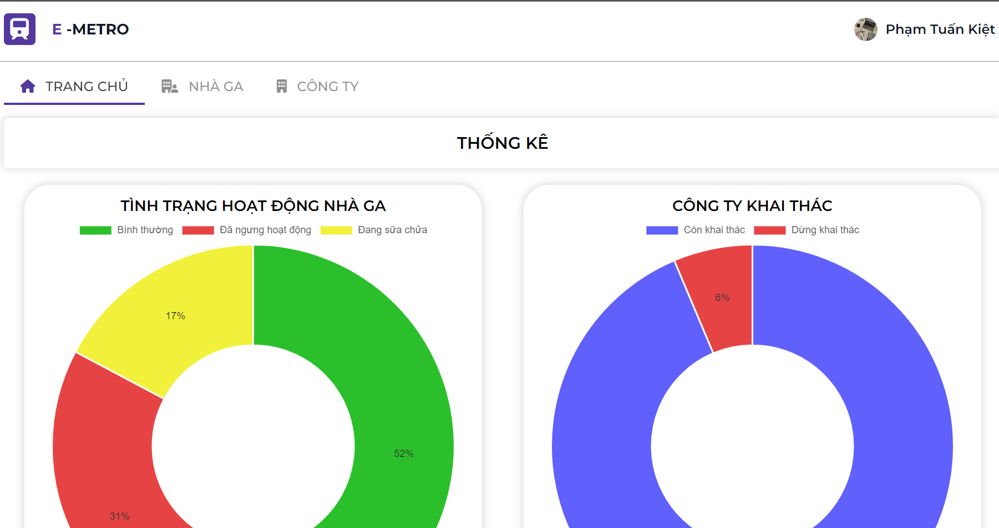
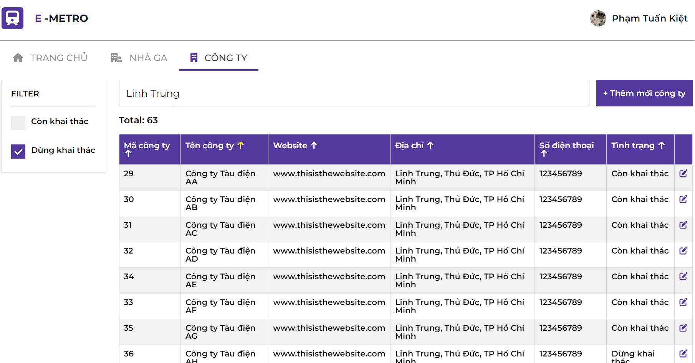
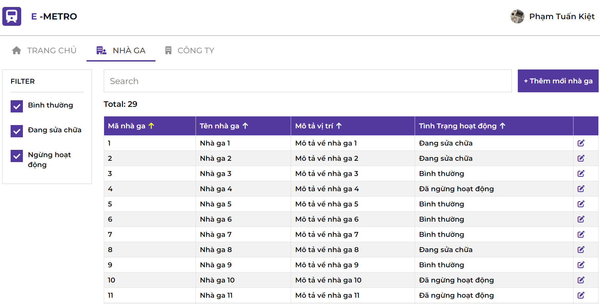
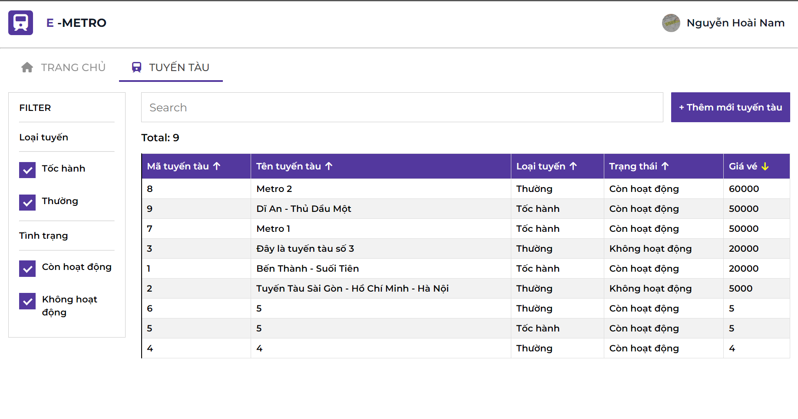

# THE E_METRO SYSTEM MANAGEMENT

- The final projec for Introduction to Software Engineering (Course SE104 | UIT) 
- Guided by [Msc. Nguyễn Thị Thanh Trúc](mailto:trucntt@uit.edu.vn)

    

## Team members
| Name         | Email               | Position   |
|--------------|---------------------|------------|
| Đào Thị Bích Huyền | 21522174@gm.uit.edu.vn | Team Leader  |
| Nguyễn Hoài Nam    | 20520075@gm.uit.edu.vn | Back-end Developer  |
| Phạm Tuấn Kiệt     | 21522262@gm.uit.edu.vn | Front-end Developer  |
| Lê Võ Duy Khiêm    | 21522215@gm.uit.edu.vn | Front-end Developer  |

## Features 

### User management
Allowing the admin to manage, create, delete, and assign user permissions.

### Company management
Allowing city transportation department staff to manage, search, create, and edit operating companies.

### Station management
Allowing city transportation department staff to manage, search, create, and edit stations.

### Route management
Allowing employees of each operating company to manage, search, create, and edit information about train routes.

### Ticket management
Allowing ticketing staff to manage tickets and review sold tickets.
