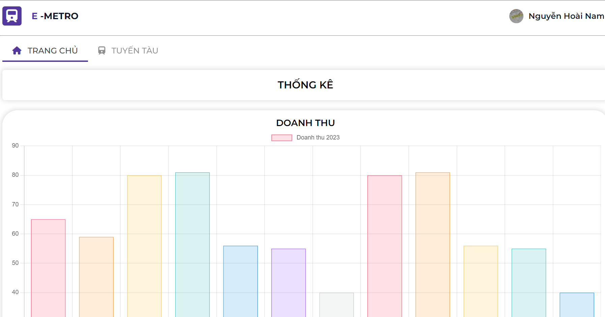

# THE E-METRO SYSTEM MANAGEMENT

- The project for Introduction to Software Engineering (Course SE104 | UIT) 
- Guided by [Msc. Nguyễn Thị Thanh Trúc](mailto:trucntt@uit.edu.vn)

<p align="center">
    
</p>


## Introduction
Welcome to the E-Metro System Management project! This project is developed as part of the Introduction to Software Engineering course (SE104) at UIT.

The E-Metro System Management is a software application designed to manage and streamline the operations of a metro transportation system. It provides various features to facilitate the efficient management of users, companies, stations, routes, and tickets within the metro system.

### Agenda

- [Introduction](#introduction)
- [Key Features](#key-features)
- [Technologies](#technologies-used)
- [Directory Structure](#directory-structure)
- [How to use?](#how-to-use)
- [Team Members](#team-members)

## Key Features 

Below are the key features of the project:

- [User management](#user-management)
- [Company management](#company-management)
- [Station management](#station-management)
- [Route management](#route-management)
- [Ticket management](#ticket-management)

### User management
Allowing the admin to manage, create, delete, and assign user permissions.


### Company management
Allowing city transportation department staff to manage, search, create, and edit operating companies.

<p align="center">

</p>

### Station management
Allowing city transportation department staff to manage, search, create, and edit stations.

<p align="center">

</p>

### Route management
Allowing employees of each operating company to manage, search, create, and edit information about train routes.

<p align="center">

</p>

### Ticket management
Allowing ticketing staff to manage tickets and review sold tickets.

## Technologies Used

Below is a list of the key technologies used in the project:

- Programming Language: HTML, CSS, JS, Python
- Framework: [FastAPI](https://fastapi.tiangolo.com)
- Database: [PostgreSQL](https://www.postgresql.org)
- Storage: [MinIO](https://min.io)
- Deployment: [Docker](https://www.docker.com)
- Version Control: [Git](https://git-scm.com)

## Directory Structure

```bash
├── docs/               # Project documentation
├── backend/                # Backend source code
│   ├── src/                # Main source code
├── fe/                # Frontend source code
│   ├── assets/                 
│   ├── html/               # UI source 
│   ├── javascripts/ 
├── docker-compose.yml/             # Define service          
├── images/             # Sample data
└── README.md               # Main README file of the project

```

## How to use ?

- We using Docker and Docker Compose (Containerization Technology) for deployment the application. Supports both MacÓS, Windows, Linux.

- Belowing, we will guide end-to-end step for setup  the application. We will using shell command line.

### Setup

- [Install Docker and Docker Compose](https://docs.docker.com/compose/install/). After check the version.
```
docker version && docker compose version
```
- Download source code.

```bash
git clone https://github.com/hoainam-nguyen/e-metro
```

### Deploy

- Deploy application using docker compose
```
cd e-metro
docker compose up
```

- Service running
    - API server run at `localhost:5002`
    - Web UI run at `localhost:8010`
    - MinIO GUI run at `localhost:9001`
    - MinIO Server run at `localhost:9000`
    - PostgreSQL run at `localhost:5432`

- Enjoy:
    - Now's experiment at `http://localhost:8010/fe/html/loginpage.html`

### Shutdown

- Shutdown all service using docker compose
```bash
docker compose up
```


## Team Members

| Name         | Email               | Position   |
|--------------|---------------------|------------|
| Đào Bích Huyền | 21522174@gm.uit.edu.vn | Team Leader  |
| Nguyễn Hoài Nam    | 20520075@gm.uit.edu.vn | Back-end Developer  |
| Phạm Tuấn Kiệt     | 21522262@gm.uit.edu.vn | Front-end Developer  |
| Lê Võ Duy Khiêm    | 21522215@gm.uit.edu.vn | Front-end Developer  |


If you have any questions, suggestions, or need assistance, please feel free to contact us using the above information.

## Copyright
```
© 6/2023 Copyright Hoai-Nam Nguyen.
```