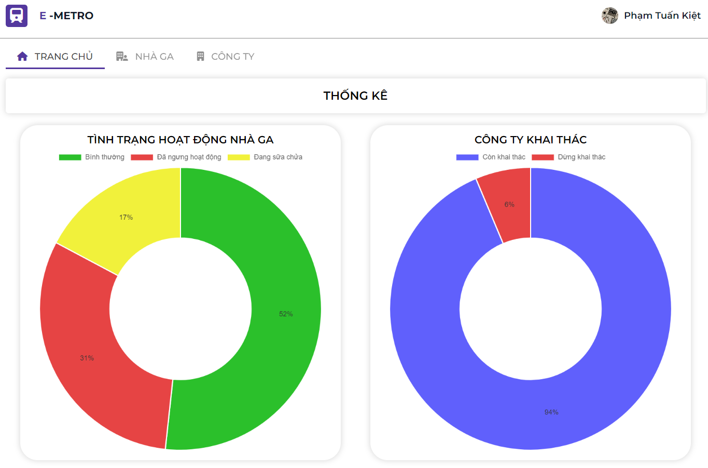

# THE E-METRO SYSTEM MANAGEMENT

- The project for Introduction to Software Engineering (Course SE104 | UIT) 
- Guided by [Msc. Nguyễn Thị Thanh Trúc](mailto:trucntt@uit.edu.vn)

<p align="center">
    
</p>

## Team members
| Name         | Email               | Position   |
|--------------|---------------------|------------|
| Đào Thị Bích Huyền | 21522174@gm.uit.edu.vn | Team Leader  |
| Nguyễn Hoài Nam    | 20520075@gm.uit.edu.vn | Back-end Developer  |
| Phạm Tuấn Kiệt     | 21522262@gm.uit.edu.vn | Front-end Developer  |
| Lê Võ Duy Khiêm    | 21522215@gm.uit.edu.vn | Front-end Developer  |


## Features 

Below are the key features of the project:

- [User management](#user-management)
- [Company management](#company-management)
- [Station management](#station-management)
- [Route management](#route-management)
- [Ticket management](#ticket-management)

### User management
Allowing the admin to manage, create, delete, and assign user permissions.


### Company management
Allowing city transportation department staff to manage, search, create, and edit operating companies.

<p align="center">

</p>

### Station management
Allowing city transportation department staff to manage, search, create, and edit stations.

<p align="center">

</p>

### Route management
Allowing employees of each operating company to manage, search, create, and edit information about train routes.

<p align="center">

</p>

### Ticket management
Allowing ticketing staff to manage tickets and review sold tickets.

## Technologies Used

Below is a list of the key technologies used in the projec:

- Programming Language: HTML, CSS, JS, Python
- Framework: [FastAPI](https://fastapi.tiangolo.com)
- Database: [PostgreSQL](https://www.postgresql.org)
- Storage: [MinIO](https://min.io)
- Deployment: [Docker](https://www.docker.com)
- Version Control: [Git](https://git-scm.com)

## Directory Structure

```bash
├── docs/                         # Project documentation
├── backend/                   # Backend source code
│   ├── src/                      # Main source code
│   ├── docker-compose.yml      
├── fronend/                    # Frontend source code
│   ├── assets/                 
│   ├── html/                   # UI source 
│   ├── javascripts/            
├── images/                     # Sample data
└── README.md          # Main README file of the project

```

## How to use ?

